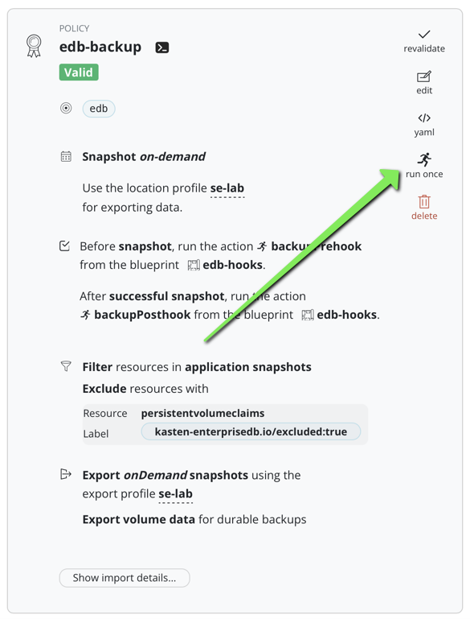

# EDB Kasten integration 

## Goals

The goal of this project is to show how Kasten can be used with the EDB external backup adapter to create fast and consistent backup for EDB cluster.

The [external backup adapter](https://www.enterprisedb.com/docs/postgres_for_kubernetes/latest/addons/) create through annotations or labels a way for third party tool as Kasten to discover the api that they have to invoke to take a safe storage backup. 

This approach take full advantage of the Kasten data management for backing up pvc (snapshot are fully incremental and portable) and using EDB API to take consistent backup of large clusters.

## How it works 

1. The EDB Backup adapter will put the annotations/labels on one of the replicas (not the primary) that has the commands to switch on backup mode (in EDB terms to be `fenced`)
2. Kasten prebackup hook blueprint discover this replica and call the EDB pre-backup command on it, now the replica is `fenced` and its PVC is fully consistent for a backup
3. Kasten proceed the backup of the complete namespace as usual but we configure the policy to exclude the PVC having the label `kasten-enterprisedb.io/excluded: "true"`, only the PVC of the `fenced` replica will be captured, the other's PVC instance will be exluded of the backup.
4. Kasten postbackup hook blueprint call the EDB post-backup commands, the elected replica is `unfenced` and back in a "normal" mode
5. When Kasten restore the namespace, the EDB operator discover the pvc of the `fenced` replica and use it as the primary for the EDB cluster, it recreates the other replica instances from it.

[Workflow diagram](./images/edb-backup-adapter.drawio.png)

# Getting Started 
## Install the operator 

If you already have EDB operator installed on kubernetes you can skip this part  

```
kubectl apply -f https://get.enterprisedb.io/cnp/postgresql-operator-1.20.2.yaml
```

This will create the operator namespace where the controller will be running.

## Create an EDB cluster, a client and some data 


```
kubectl create ns edb
kubectl apply -f cluster-example-2.yaml -n edb
```

Wait for the cluster to be fully ready.
```
kubectl get clusters.postgresql.k8s.enterprisedb.io -n edb
NAME              AGE   INSTANCES   READY   STATUS                     PRIMARY
cluster-example   19m   3           3       Cluster in healthy state   cluster-example-1
```


Install the cnp plugin if you haven't it yet 
```
curl -sSfL \
  https://github.com/EnterpriseDB/kubectl-cnp/raw/main/install.sh | \
  sudo sh -s -- -b /usr/local/bin
```

Create a client certificate to the database
```
kubectl cnp certificate cluster-app \
  --cnp-cluster cluster-example \
  --cnp-user app \
  -n edb 
```

Now you can create the client 
```
kubectl create -f client.yaml -n edb 
```

Create some data 
```
kubectl exec -it deploy/cert-test -- bash
psql " $DATABASE_URL "
\c app
DROP TABLE IF EXISTS links;
CREATE TABLE links (
	id SERIAL PRIMARY KEY,
	url VARCHAR(255) NOT NULL,
	name VARCHAR(255) NOT NULL,
	description VARCHAR (255),
        last_update DATE
);
INSERT INTO links (url, name, description, last_update) VALUES('https://kasten.io','Kasten','Backup on kubernetes',NOW());
select * from links;
\q
exit
```

## Add the backup decorator annotations to the cluster 

You can skip this part if you create the cluter from the previous section because with [cluster-example-2](./cluster-example-2.yaml) the cluster-example already include the kasten addon.

If you have not it yet just had this annotation in your cluster CR 
```
    "k8s.enterprisedb.io/addons": '["kasten"]'
```

If your version of EDB is old and does not support the kasten addons you can create all the annotations and labels manually 
you have an example in [cluster-example.yaml ](./cluster-example.yaml). 


## Install the edb blueprint

```
kubectl create -f edb-hooks.yaml
```

## Create a backup policy with the exclude filters and the hooks 

Create a Kasten policy for the edb namespace: set up a location profile for export and kanister actions. 

### Add the exlude filters :

```
kasten-enterprisedb.io/excluded:true
```


### Add the hooks :


## Launch a backup 

Launch a backup, that will create 2 restorepoints a local and a remote.



When you'll visit the restore point you'll see that only one PVC has been taken then one that map to 
the `fenced` instance.


## Let's test a restore

Delete the namespace edb 

```
kubectl delete ns edb
```

## Restore 

Because you deleted the namespace all the volumesnaphot are gone hence you need to restore from the external
location profile.


Just click restore and wait for the EDB cluster to restart.

You should see pod cluster-example-2 immediatly starting (without initialization of the database) and the cluster-example-3 and cluster-example-4 joining.

```
kubectl get po -n edb -w
NAME                         READY   STATUS     RESTARTS   AGE
cert-test-5dcf5cb6b8-fhf4m   1/1     Running    0          3s
cluster-example-2            0/1     Init:0/1   0          1s
cluster-example-2            0/1     PodInitializing   0          3s
cluster-example-2            0/1     Running           0          4s
cluster-example-2            1/1     Running           0          5s
cluster-example-2            1/1     Running           0          5s
cluster-example-3-join-vm6d9   0/1     Pending           0          0s
cluster-example-3-join-vm6d9   0/1     Pending           0          5s
cluster-example-3-join-vm6d9   0/1     Init:0/1          0          5s
cluster-example-3-join-vm6d9   0/1     PodInitializing   0          10s
cluster-example-3-join-vm6d9   1/1     Running           0          11s
cluster-example-3-join-vm6d9   0/1     Completed         0          13s
cluster-example-3-join-vm6d9   0/1     Completed         0          15s
cluster-example-3-join-vm6d9   0/1     Completed         0          16s
cluster-example-3              0/1     Pending           0          0s
cluster-example-3              0/1     Pending           0          0s
cluster-example-3              0/1     Init:0/1          0          0s
cluster-example-3              0/1     PodInitializing   0          4s
cluster-example-3              0/1     Running           0          5s
cluster-example-3              0/1     Running           0          5s
cluster-example-3              1/1     Running           0          6s
cluster-example-4-join-rtpxf   0/1     Pending           0          0s
cluster-example-4-join-rtpxf   0/1     Pending           0          5s
cluster-example-4-join-rtpxf   0/1     Init:0/1          0          5s
cluster-example-4-join-rtpxf   0/1     PodInitializing   0          9s
cluster-example-4-join-rtpxf   0/1     Completed         0          10s
cluster-example-4-join-rtpxf   0/1     Completed         0          12s
cluster-example-4-join-rtpxf   0/1     Completed         0          13s
cluster-example-4              0/1     Pending           0          0s
cluster-example-4              0/1     Pending           0          0s
cluster-example-4              0/1     Init:0/1          0          0s
cluster-example-4              0/1     PodInitializing   0          6s
cluster-example-4              0/1     Running           0          7s
cluster-example-4              0/1     Running           0          7s
cluster-example-4              1/1     Running           0          8s
cluster-example-4-join-rtpxf   0/1     Terminating       0          21s
cluster-example-3-join-vm6d9   0/1     Terminating       0          43s
cluster-example-4-join-rtpxf   0/1     Terminating       0          21s
cluster-example-3-join-vm6d9   0/1     Terminating       0          43s
cluster-example-3              1/1     Running           0          28s
cluster-example-2              1/1     Running           0          50s
cluster-example-4              1/1     Running           0          9s
```

### Check your data are back.

As you restore everything you also restore the client, connect to the client and check you have your data.

```
kubectl exec -it deploy/cert-test -- bash
psql " $DATABASE_URL "
\c app
select * from links;
\q
exit
```

You should see your data back 
```
app=> select * from links;
 id |        url        |  name  |     description      | last_update 
----+-------------------+--------+----------------------+-------------
  1 | https://kasten.io | Kasten | Backup on kubernetes | 2024-03-25
```
